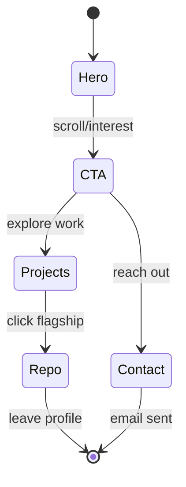
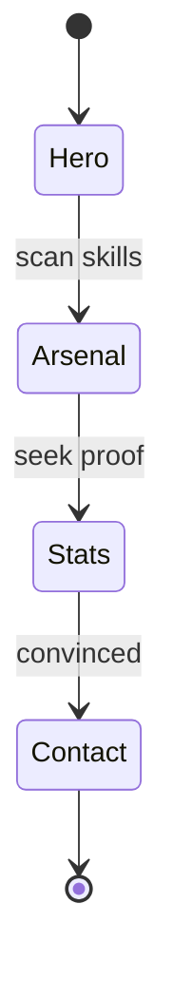

# AppFlow — themanoj-025: Visitor Flow & Section Map

| Field | Value |
| --- | --- |
| Version | v0.1 |
| Last Updated | 2026-08-06 |
| Owner | Manoj (profile owner) |
| Status | Approved |

---

> Note: There is no interactive app; "screens" are the vertical sections of the rendered README. This file maps every section and every exit link.

## 1. Screen (Section) Inventory

| ID | Section | Purpose | Entry | Exit Points | Auth |
| --- | --- | --- | --- | --- | --- |
| SEC-001 | Hero Header | Identity at a glance | Top of profile | Typing SVG loop | N |
| SEC-002 | Contact CTA Row | Drive outreach | Below hero | GitHub / email / resume / open-roles links | N |
| SEC-003 | Featured Engineering Work | Showcase 6 flagship repos | Below CTAs | Repo links (external) | N |
| SEC-004 | Technical Arsenal | Skill breadth by category | Below showcase | None (decorative) | N |
| SEC-005 | GitHub Stats | Proof-of-work visuals | Below arsenal | None | N |
| SEC-006 | Let's Build / Contact Footer | Final CTA | Bottom | LinkedIn / email | N |

## 2. Navigation Map

```mermaid
graph LR
    SEC-001[SEC-001 Hero] --> SEC-002[SEC-002 Contact CTA]
    SEC-002 -->|GitHub| EXT1[github.com/themanoj-025 repos]
    SEC-002 -->|mailto| EXT2[code.me.025@gmail.com]
    SEC-002 -->|Resume PDF| EXT3[Resume.pdf]
    SEC-002 -->|Open for roles| EXT2
    SEC-003[SEC-003 Featured Work] -->|repo links| EXT4[Match-Mind / AegisAI / UNION-BANK- / Smart-Spam-Detector / AI-Telegram-News-Bot / Emotion-Lens]
    SEC-003 -->|chips| SEC-004
    SEC-004[SEC-004 Arsenal] --> SEC-005[SEC-005 GitHub Stats]
    SEC-005 --> SEC-006[SEC-006 Footer]
    SEC-006 -->|LinkedIn| EXT5[linkedin.com/in/manoj-jana]
    SEC-006 -->|mailto| EXT2
```

## 3. Detailed Flow per Journey

### 3.1 Discovery Journey



### 3.2 Credibility Journey



## 4. Empty / Loading / Error States

| Section | Loading | Error (service down) |
| --- | --- | --- |
| SEC-001 | Static text renders instantly | Typing SVG broken → static subtitle still visible |
| SEC-002 | N/A (static links) | Broken link → visitor can use other CTAs |
| SEC-003 | N/A | Repo deleted → 404; mitigated by link check |
| SEC-005 | Cards load async | Broken image icon → remove card until recovery |

## 5. Edge Cases & Branching Logic

| IF | THEN |
| --- | --- |
| Stats service rate-limited | Show placeholder; refresh later |
| New flagship repo added | Add to grid (max 6 slots; rotate) |
| Email changed | Update mailto in SEC-002 + SEC-006 |
| Resume URL changes | Update raw URL in SEC-002 |
| Dark/light theme | Use theme-aware SVG services where possible |

## 6. Notifications & Re-engagement

- No push/email notifications (static profile).
- Re-engagement is passive: fresh commits keep stats/heatmap alive.

## 7. Cross-Platform Deltas

- Mobile: tables collapse to stacked layout (GitHub handles responsively); badge rows wrap.
- Desktop: full two-column layout (ascii + info card side by side).

## 8. Related Documents

| Document | Relationship |
| --- | --- |
| [PRD.md](../product/PRD.md) | Sections trace to REQ-### IDs |
| [Design.md](Design.md) | Visual tokens per section |
| [Testing.md](../technical/Testing.md) | Link/render verification per section |
