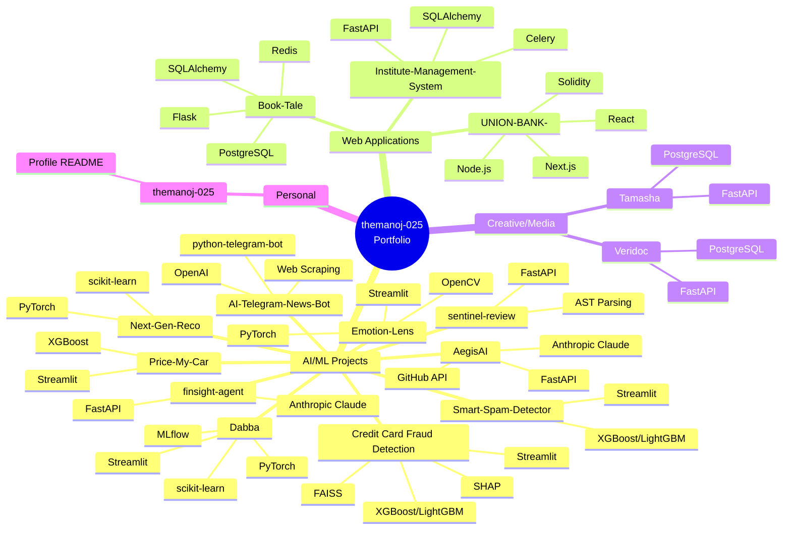
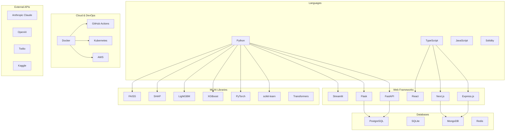
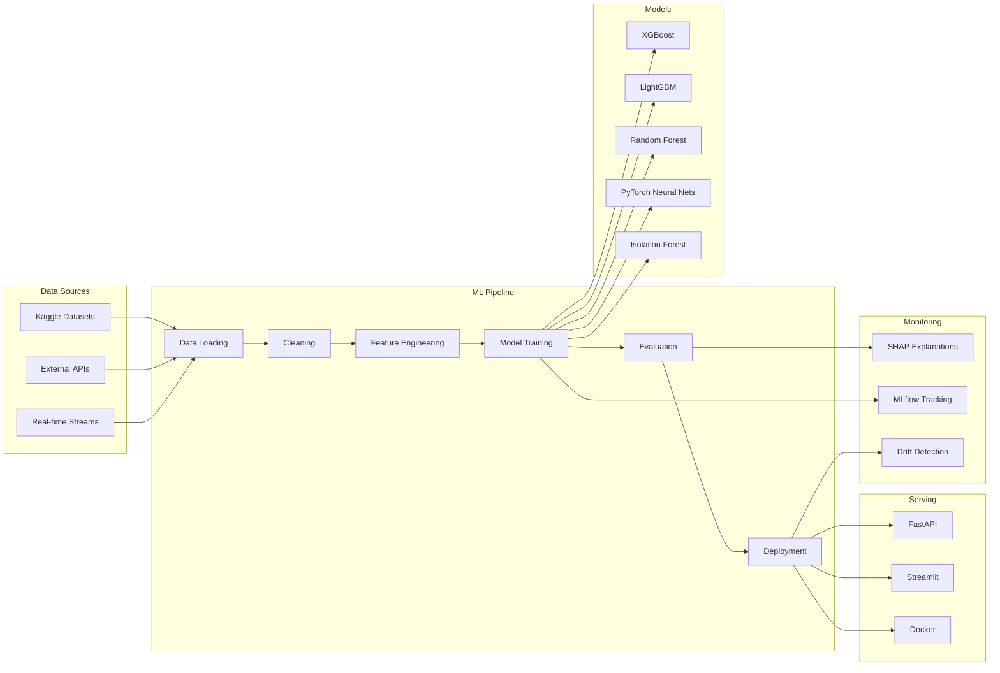
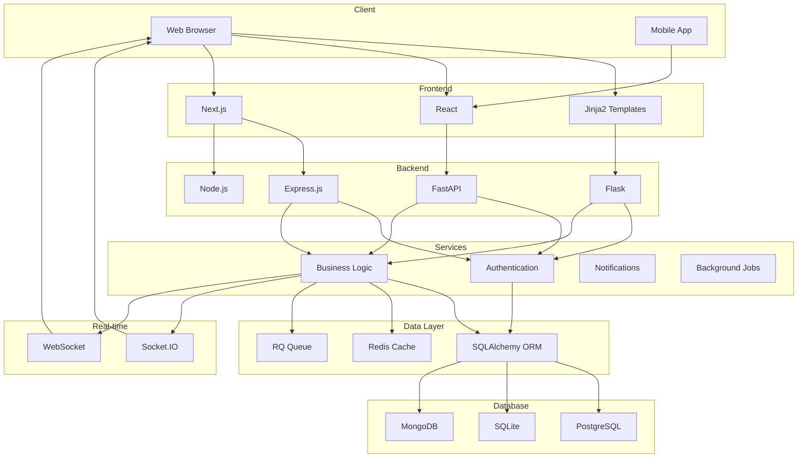
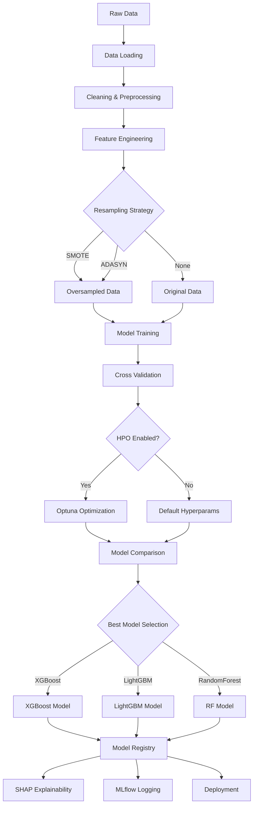
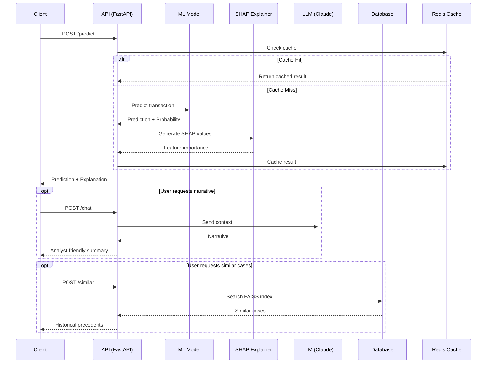
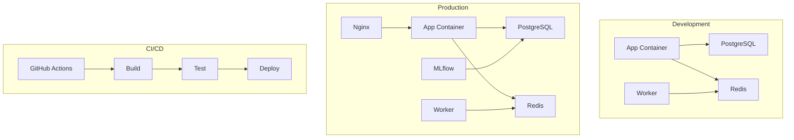
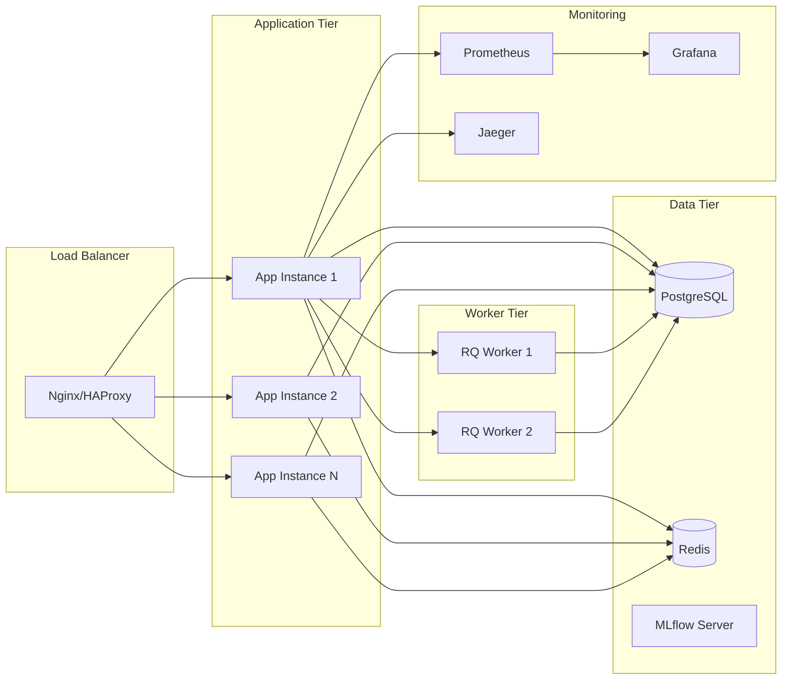
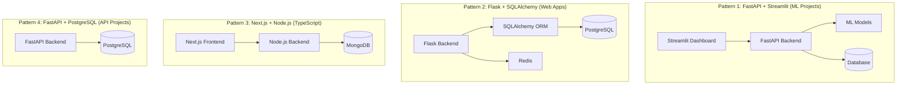
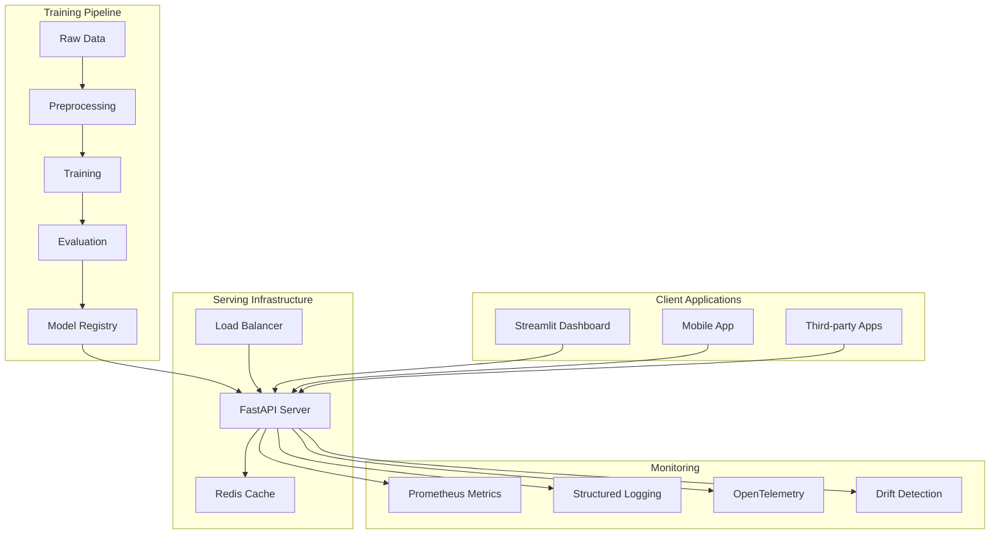

# 🏗️ Portfolio Architecture Diagram

> Visual representation of all 17 projects, their relationships, shared technologies, and architectural patterns.

---

## Table of Contents

- [High-Level Portfolio Overview](#high-level-portfolio-overview)
- [Technology Ecosystem Map](#technology-ecosystem-map)
- [Project Category Diagrams](#project-category-diagrams)
- [Data Flow Architectures](#data-flow-architectures)
- [Infrastructure & Deployment](#infrastructure--deployment)

---

## High-Level Portfolio Overview



---

## Technology Ecosystem Map



---

## Project Category Diagrams

### 🤖 AI/ML Projects Architecture



### 🌐 Web Applications Architecture



---

## Data Flow Architectures

### ML Model Training Pipeline



### Real-time Prediction Flow



---

## Infrastructure & Deployment

### Docker Architecture



### Multi-Service Deployment



---

## Shared Technology Patterns

### Common Architecture Patterns



### ML Model Serving Architecture



---

## Visual Summary

### Portfolio at a Glance

```
┌─────────────────────────────────────────────────────────────────────────┐
│                        themanoj-025 Portfolio                          │
├─────────────────────────────────────────────────────────────────────────┤
│                                                                         │
│  ┌─────────────────┐  ┌─────────────────┐  ┌─────────────────┐        │
│  │   AI/ML (10)    │  │  Web Apps (4)   │  │  Creative (2)   │        │
│  │                 │  │                 │  │                 │        │
│  │ • AegisAI       │  │ • Book-Tale     │  │ • Tamasha       │        │
│  │ • AI-News-Bot   │  │ • Institute-Mgmt│  │ • Veridoc       │        │
│  │ • Fraud Detection│ │ • Match-Mind    │  │                 │        │
│  │ • Dabba         │  │ • UNION-BANK-   │  │                 │        │
│  │ • Emotion-Lens  │  │                 │  │                 │        │
│  │ • FinSight      │  │                 │  │                 │        │
│  │ • Next-Gen-Reco │  │                 │  │                 │        │
│  │ • Price-My-Car  │  │                 │  │                 │        │
│  │ • Sentinel      │  │                 │  │                 │        │
│  │ • Spam-Detector │  │                 │  │                 │        │
│  └─────────────────┘  └─────────────────┘  └─────────────────┘        │
│                                                                         │
├─────────────────────────────────────────────────────────────────────────┤
│  Languages: Python (14) │ TypeScript (2) │ JavaScript (1) │ Solidity  │
├─────────────────────────────────────────────────────────────────────────┤
│  ML: scikit-learn, PyTorch, XGBoost, LightGBM, SHAP, FAISS            │
│  Web: FastAPI, Flask, Streamlit, Express.js, Next.js, React            │
│  DB: PostgreSQL, SQLite, MongoDB, Redis                                 │
│  DevOps: Docker, GitHub Actions, Kubernetes                            │
│  AI: Anthropic Claude, OpenAI                                          │
└─────────────────────────────────────────────────────────────────────────┘
```

---

## How to Read These Diagrams

1. **Mind Map** — High-level categorization of all projects
2. **Technology Ecosystem** — Relationships between technologies
3. **Category Diagrams** — Architecture patterns for each project type
4. **Data Flow** — How data moves through ML pipelines
5. **Infrastructure** — Deployment and scaling patterns
6. **Sequence Diagrams** — Real-time prediction flows

---

*Architecture diagrams generated: August 8, 2026*
