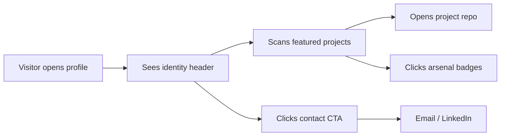

# PRD — themanoj-025: GitHub Profile & Personal Brand Platform

| Field | Value |
| --- | --- |
| Version | v0.1 |
| Last Updated | 2026-08-06 |
| Owner | Manoj (profile owner) |
| Status | Approved |

---

## 1. Executive Summary

`themanoj-025` is the GitHub profile repository (`<username>/<username>`) that functions as a living personal-brand platform for an AI Systems Engineer. It is not a software product in the traditional sense — the "product" is the profile itself: a self-updating, visually rich README that communicates identity (whoami cards, ASCII art, contribution heatmap), showcases featured engineering work (Match-Mind, AegisAI, UNION-BANK-, Smart-Spam-Detector, AI-Telegram-News-Bot, Emotion-Lens), and surfaces a technical arsenal via badge arrays. This documentation suite treats the profile as a maintainable digital asset with defined goals, metrics, and operational rules.

## 2. Problem Statement

- **User pain:** A GitHub profile is the first impression for recruiters, collaborators, and clients; a sparse or unstructured profile loses opportunities and fails to convey capability.
- **Evidence/context:** Profiles with visual identity and curated project showcases measurably outperform plain profiles for discoverability; the owner maintains 14 repos and 500+ commits that need effective representation.
- **Cost of not solving it:** Undervalued personal brand, missed roles/collaborations, and unmaintained stale content that misrepresents current skills.

## 3. Goals & Non-Goals

| Goal | Metric | Target |
| --- | --- | --- |
| Communicate identity at a glance | Time to understand "who this is" | < 5 seconds (above-the-fold) |
| Showcase flagship work | Featured projects linked | 6 flagship repos featured |
| Convey skill breadth | Technical arsenal categories | ≥ 8 categories displayed |
| Stay current | Stale content age | No section older than 6 months |
| Drive connection | Contact CTAs reachable | 3+ contact paths (GitHub, email, LinkedIn) |

**Non-Goals (v1):**

- No hosted website (profile lives entirely on GitHub).
- No dynamic server-side rendering (static README + badge services only).
- No click analytics on profile views (GitHub page-view counter only).
- No automation that writes to other repos from this profile repo.

## 4. Target Users & Personas

| Persona | Role | Goals | Frustrations | Quote | Tech Level |
| --- | --- | --- | --- | --- | --- |
| Recruiter — Hiring manager | Talent acquisition | Quickly assess seniority and fit | Vague profiles, dead links | "Can I tell what they actually build?" | Low |
| Collaborator — Engineer | Peer/open-source | Find overlapping interests and contact | No showcased work | "Show me something real to fork." | High |
| Client — Consulting lead | Business stakeholder | Gauge credibility for AI work | Generic tech lists | "Is this person production-grade?" | Medium |
| Owner — Manoj | Profile owner | Grow visibility, keep it truthful and current | Stale badges, outdated links | "My profile is my storefront." | High |

## 5. User Stories

| ID | As a... | I want... | So that... | Priority | Acceptance Criteria |
| --- | --- | --- | --- | --- | --- |
| US-001 | Visitor | To immediately see identity + role | I know who this is in seconds | P0 | Header renders title, role, typing intro, badges |
| US-002 | Visitor | To see the top engineering work | I can judge capability quickly | P0 | 6 featured projects with links + tech chips |
| US-003 | Visitor | To explore the full skill set | I can match needs to expertise | P1 | Arsenal sections for ≥ 8 categories |
| US-004 | Visitor | To contact the owner | I can reach out | P0 | GitHub, email, LinkedIn links work |
| US-005 | Owner | To keep the profile accurate | It reflects current work | P1 | Quarterly review checklist in ../project/Tracker.md |
| US-006 | Visitor | To see activity/credibility signals | I trust the profile | P2 | Contribution heatmap + GitHub stats render |

## 6. Feature List

**Epic: Identity (header)**

| ID | Feature | Description | Priority | Status |
| --- | --- | --- | --- | --- |
| REQ-001 | Hero header | Title, role subtitle, typing SVG intro | P0 | Live |
| REQ-002 | Contact CTA row | GitHub / email / resume / open-roles buttons | P0 | Live |
| REQ-003 | Whoami cards | ASCII art + info card SVGs | P1 | Live |

**Epic: Showcase**

| ID | Feature | Description | Priority | Status |
| --- | --- | --- | --- | --- |
| REQ-010 | Featured projects grid | 6 flagship repos with descriptions + chips | P0 | Live |
| REQ-011 | Tech chips per project | Language/framework badges | P1 | Live |
| REQ-012 | Technical arsenal | Category badge arrays | P1 | Live |

**Epic: Proof & Engagement**

| ID | Feature | Description | Priority | Status |
| --- | --- | --- | --- | --- |
| REQ-020 | Contribution heatmap | GitHub-style year activity | P1 | Live |
| REQ-021 | GitHub stats cards | Followers, stars, streak, languages | P2 | Live |
| REQ-022 | Activity graph | Commit timeline visualization | P2 | Live |
| REQ-023 | Profile view counter | Visitor counter badge | P2 | Live |

**Epic: Maintenance (ops)**

| ID | Feature | Description | Priority | Status |
| --- | --- | --- | --- | --- |
| REQ-030 | Link health | All hrefs resolve to valid targets | P0 | Maintained |
| REQ-031 | Content freshness | No stale sections | P1 | Maintained |
| REQ-032 | SVG asset pipeline | Scripts regenerate heatmap/cards | P2 | Planned |

## 7. User Journeys (high level)

## 8. Success Metrics / KPIs

| Metric | Target | Measurement Method |
| --- | --- | --- |
| North star: profile-driven connections | ≥ 2 inbound contacts/month | Email/LinkedIn messages citing profile |
| Featured project click-through | ≥ 30% of visitors open ≥ 1 project | Manual/analytics review |
| Profile views | Growing MoM | komarev counter + repo insights |
| Followers growth | +10% quarterly | GitHub follower count |

## 9. Assumptions & Dependencies

- GitHub renders markdown README with external image services (shields.io, readme-stats, streak-stats, komarev).
- Third-party badge/stats services remain available and free; fallback = remove/replace badge.
- Owner maintains repo access and updates content manually or via scripts.
- No sensitive data is embedded in the README (see ../technical/SecurityAndCompliance.md).

## 10. Risks

Top risks from ../project/RiskRegister.md:

1. **Broken external services (R-01):** Stats/typing services go down → badges fail to render — mitigate with periodic link checks and service alternatives.
2. **Stale profile (R-02):** Content ages, misrepresenting skills — mitigate with quarterly review cadence (REQ-031).
3. **Over-disclosure (R-05):** Public email scraped by spam bots — mitigate with mailto obfuscation/expectation note and a dedicated contact inbox.

## 11. Release Criteria (v1 done)

- [ ] Header identity + CTAs render correctly on GitHub
- [ ] 6 featured projects with working links
- [ ] Arsenal covers ≥ 8 categories
- [ ] All hrefs resolve (no 404s)
- [ ] Dark/light theme renders acceptably (theme-aware SVGs)
- [ ] Maintenance checklist exists in ../project/Tracker.md

## 12. Open Questions

| # | Question | Owner | Resolve By |
| --- | --- | --- | --- |
| OQ-01 | Add blog/links section to profile? | Owner | 2026-09-01 |
| OQ-02 | Automate stats-card refresh via scheduled GitHub Action? | Owner | 2026-10-01 |

## 13. Related Documents

| Document | Relationship |
| --- | --- |
| [TechSpec.md](../technical/TechSpec.md) | How the profile is built (badges/SVGs/services) |
| [AppFlow.md](../design/AppFlow.md) | Section-by-section visitor flow |
| [Design.md](../design/Design.md) | Visual system (colors, typography, badges) |
| [Schema.md](../technical/Schema.md) | Content model of the profile |
| [ImplementationPlan.md](../project/ImplementationPlan.md) | Maintenance phases |
| [Tracker.md](../project/Tracker.md) | Live status of REQ items |
| [Rules.md](../project/Rules.md) | Standards for editing the profile |
| [API.md](../technical/API.md) | External services/integrations used |
| [SecurityAndCompliance.md](../technical/SecurityAndCompliance.md) | Disclosure & privacy rules |
| [Testing.md](../technical/Testing.md) | Rendering/link verification |
| [Deployment.md](../technical/Deployment.md) | How the README ships to GitHub |
| [Glossary.md](../reference/Glossary.md) | Vocabulary |
| [RiskRegister.md](../project/RiskRegister.md) | Full risk register |
