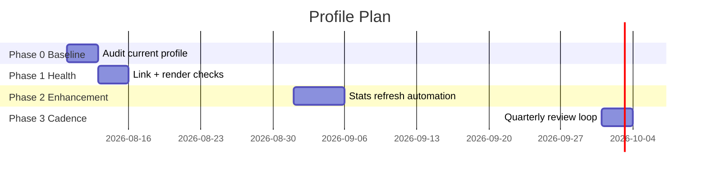
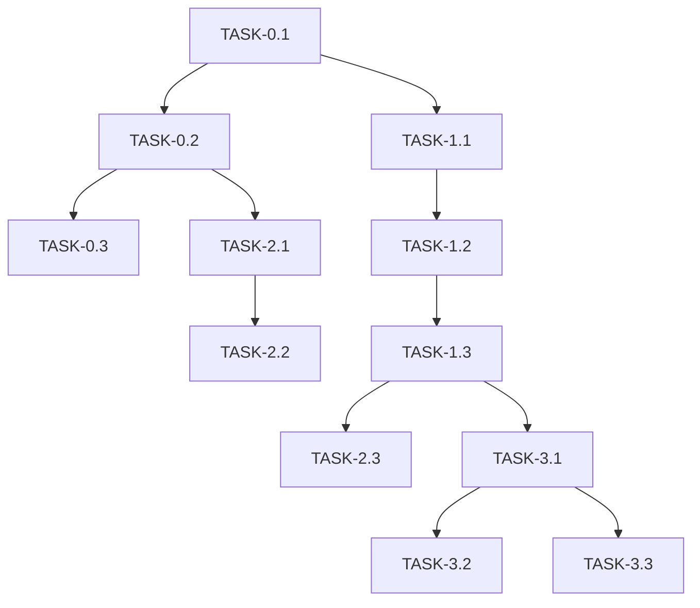

# ImplementationPlan — themanoj-025: Profile Maintenance & Enhancement Plan

| Field | Value |
| --- | --- |
| Version | v0.1 |
| Last Updated | 2026-08-06 |
| Owner | Manoj (profile owner) |
| Status | Approved |

---

## 1. Build Philosophy

Keep the profile truthful, current, and dependency-light. Small, reviewable PRs; every change previewed before merge; external services used only where they add clear value.

## 2. Phase Overview

## 3. Phase Breakdown

### Phase 0 — Baseline Audit

**Goal:** Know the current state. **Exit:** Documented inventory + gap list.

| TASK | Description | Depends | Owner | Effort | Maps to |
| --- | --- | --- | --- | --- | --- |
| TASK-0.1 | Inventory sections + links | — | Owner | 1d | REQ-030 |
| TASK-0.2 | Verify all external services render | TASK-0.1 | Owner | 1d | REQ-021 |
| TASK-0.3 | Document gaps vs PRD goals | TASK-0.2 | Owner | 1d | PRD §3 |

### Phase 1 — Health

**Goal:** Zero broken links, clean renders. **Exit:** Link check green.

| TASK | Description | Depends | Owner | Effort | Maps to |
| --- | --- | --- | --- | --- | --- |
| TASK-1.1 | Fix broken/outdated hrefs | TASK-0.1 | Owner | 1d | REQ-030 |
| TASK-1.2 | Add alt text everywhere | TASK-1.1 | Owner | 1d | REQ-031 |
| TASK-1.3 | Preview on mobile + light mode | TASK-1.2 | Owner | 1d | Design §9 |

### Phase 2 — Enhancement

**Goal:** Automation + freshness. **Exit:** Stats refresh runs on schedule.

| TASK | Description | Depends | Owner | Effort | Maps to |
| --- | --- | --- | --- | --- | --- |
| TASK-2.1 | Heatmap/stat regeneration script | TASK-0.2 | Owner | 2d | REQ-032 |
| TASK-2.2 | GitHub Action cron refresh | TASK-2.1 | Owner | 2d | REQ-032 |
| TASK-2.3 | Replace deprecated services with fallbacks | TASK-1.3 | Owner | 1d | R-01 |

### Phase 3 — Cadence

**Goal:** Sustainable maintenance. **Exit:** Quarterly loop documented + scheduled.

| TASK | Description | Depends | Owner | Effort | Maps to |
| --- | --- | --- | --- | --- | --- |
| TASK-3.1 | Write quarterly review checklist | TASK-1.3 | Owner | 1d | REQ-031 |
| TASK-3.2 | Schedule calendar reminder + tracker updates | TASK-3.1 | Owner | 0.5d | Tracker |
| TASK-3.3 | Rotate featured slots as repos grow | TASK-3.1 | Owner | 0.5d | REQ-010 |

## 4. Dependency Graph

## 5. Environment & Tooling Setup Checklist

- [ ] Access to repo `themanoj-025/themanoj-025`
- [ ] Local markdown preview (GitHub web editor or VS Code preview)
- [ ] Link checker available (e.g., lychee or manual list)
- [ ] (Phase 2) GitHub Actions enabled on repo

## 6. Rollout Strategy

- All changes via PR; preview via web editor "Preview changes" or fork-based preview.
- Service swaps staged: add new badge, verify render, then remove old.
- Never break existing links without an HTTP redirect or updated target.

## 7. Definition of Done (global)

- [ ] Previewed and renders correctly on GitHub (dark + light)
- [ ] Link check passes for changed links
- [ ] Alt text present on new images
- [ ] No secrets/credentials introduced
- [ ] Tracker.md updated

## 8. Related Documents

| Document | Relationship |
| --- | --- |
| [PRD.md](../product/PRD.md) | REQ IDs traced |
| [AppFlow.md](../design/AppFlow.md) | Sections touched |
| [Tracker.md](Tracker.md) | Live status |
| [Rules.md](Rules.md) | Editing conventions |
