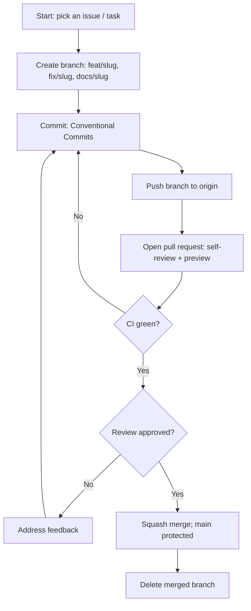

# Rules — themanoj-025: Standards & Operating Rules

| Field | Value |
| --- | --- |
| Version | v0.1 |
| Last Updated | 2026-08-06 |
| Owner | Manoj (profile owner) |
| Status | Approved |

---

## 1. Guiding Principles

1. **Truthful representation** — every claim matches reality (skills, roles, stats).
2. **Proof over claims** — link to real repos; never fake metrics.
3. **Zero broken links** — every href verified at edit time.
4. **Small, reviewable changes** — preview before merge.
5. **Dependency-light** — prefer static content over fragile services.
6. **Freshness cadence** — quarterly review, at minimum.
7. **No secrets, ever** — the repo is public; nothing sensitive lives here.

## 2. Content Style

- **Format:** GitHub-flavored Markdown + HTML tables where layout demands (tables allowed).
- **Naming:** descriptive section headings; consistent badge params (`flat-square` for chips, `for-the-badge` for arsenal).
- **Structure:** single `README.md` as source of truth; assets in repo root or `assets/`.

## 3. Git Workflow

- Branches: `feat/<slug>`, `fix/<slug>`, `docs/<slug>`.
- Commits: Conventional Commits (`feat:`, `fix:`, `docs:`, `chore:`).
- PRs: self-review + preview; squash merge; main protected (optional but recommended).
- Never force-push to main.

## 4. Testing Requirements

- **MUST:** link check on changed hrefs; preview render (dark + light); alt-text presence on new images.
- **Recommended:** automated link-check GitHub Action; markdown lint.
- No unit tests (no application code); see ../technical/Testing.md.

## 5. AI Agent Operating Rules

- Read Tracker.md and ImplementationPlan.md before editing.
- Never invent skills/repos/roles not present in the actual GitHub account — flag ambiguity instead.
- Verify every URL resolves before committing (use read_url or a link checker).
- Never add badges to technologies absent from real repos.
- Never commit secrets or personal data beyond the public contact info already exposed.
- Preserve existing section IDs (SEC-001..006) when editing content.
- When a rule conflicts with a request, state the conflict rather than silently picking one.

## 6. Security Baseline Rules

- Secret scan on every PR (gitleaks or pre-commit hook).
- Email exposure is intentional (public mailto) — never add phone numbers or home addresses.
- External service URLs must use HTTPS only.
- No embed scripts/tracking pixels (GitHub sanitizes; keep it clean anyway).

## 7. Documentation Rules

- Profile structure changes → update ../design/AppFlow.md + ../technical/Schema.md in the same PR.
- New featured project → update ../product/PRD.md REQ-010 list + Schema TBL-featured_project.
- New arsenal category → update Schema TBL-arsenal_category.

## 8. Prohibited Patterns

| Pattern | Why |
| --- | --- |
| Fake stats/metrics | Destroys trust |
| Secrets/credentials in README or assets | Public exposure |
| Hotlinking unvetted third-party images | Broken renders |
| Claiming skills without repo evidence | Misrepresentation |
| Removing alt text | Accessibility regression |

## 9. Escalation Rules

**Ask the owner:**
- Adding personal contact surfaces beyond email/LinkedIn.
- Removing a featured project.
- Adding third-party tracking/analytics.

**Decide autonomously:**
- Badge parameter tweaks, link fixes, alt text, formatting.

## Git / PR Workflow

## 10. Related Documents

| Document | Relationship |
| --- | --- |
| [Testing.md](../technical/Testing.md) | Enforcement of Section 4 |
| [SecurityAndCompliance.md](../technical/SecurityAndCompliance.md) | Full disclosure policy |
| [Schema.md](../technical/Schema.md) | Content model to keep consistent |
