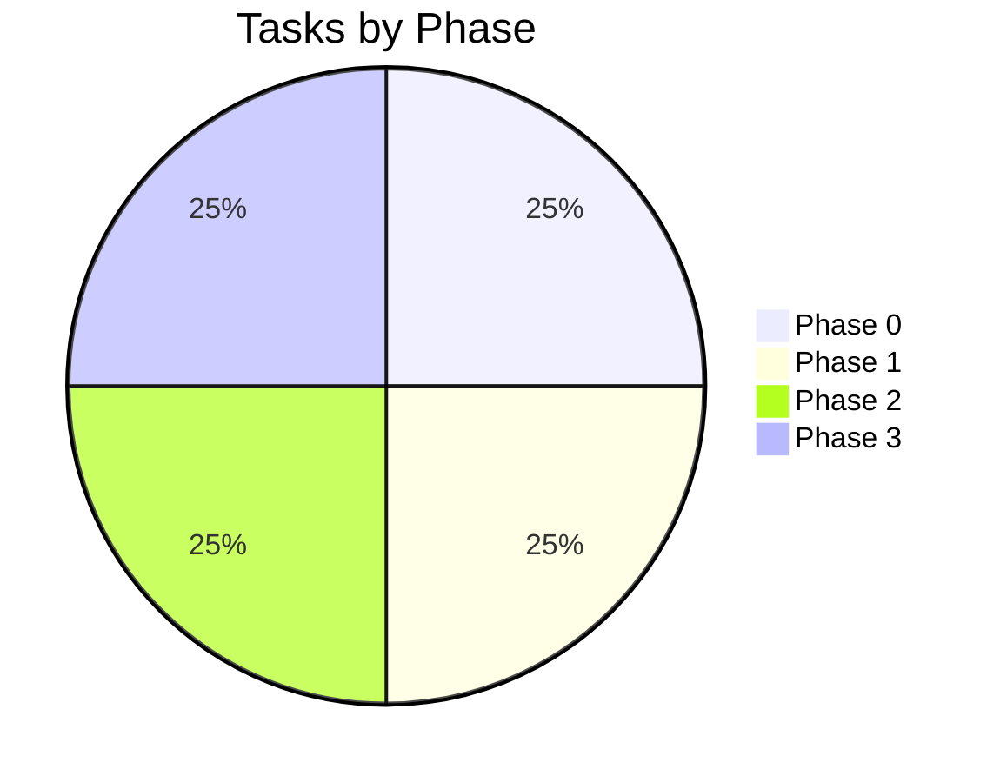

# Tracker — themanoj-025: Living Status Tracker

| Field | Value |
| --- | --- |
| Version | v0.1 |
| Last Updated | 2026-08-06 |
| Owner | Manoj (profile owner) |
| Status | Active |

---

## 1. Snapshot Dashboard

| Metric | Value |
| --- | --- |
| Overall % Complete | 10% |
| Current Phase | Phase 0 — Baseline Audit |
| Tasks Done / Total | 1 / 10 |
| Blockers (open) | 0 |
| Profile "release" state | Live (already on GitHub) |

## 2. Status Legend

🟢 Done | 🟡 In Progress | 🔴 Blocked | ⚪ Not Started | 🔵 In Review

## 3. Phase Progress Bars

| Phase | Progress |
| --- | --- |
| Phase 0 — Baseline Audit | [█░░░░░░░░░] 10% |
| Phase 1 — Health | [░░░░░░░░░░] 0% |
| Phase 2 — Enhancement | [░░░░░░░░░░] 0% |
| Phase 3 — Cadence | [░░░░░░░░░░] 0% |

## 4. Full Task Table

| TASK | Description | Status | Assignee | Start | Target | Actual | Notes |
| --- | --- | --- | --- | --- | --- | --- | --- |
| TASK-0.1 | Inventory sections + links | 🟢 | Owner | 08-06 | 08-10 | 08-06 | Docs suite produced inventory |
| TASK-0.2 | Verify external services render | ⚪ | Owner | — | 08-12 | — | — |
| TASK-0.3 | Document gaps vs PRD goals | ⚪ | Owner | — | 08-13 | — | — |
| TASK-1.1 | Fix broken/outdated hrefs | ⚪ | Owner | — | 08-14 | — | — |
| TASK-1.2 | Add alt text everywhere | ⚪ | Owner | — | 08-15 | — | — |
| TASK-1.3 | Preview mobile + light mode | ⚪ | Owner | — | 08-15 | — | — |
| TASK-2.1 | Regeneration script | ⚪ | Owner | — | 09-03 | — | — |
| TASK-2.2 | Action cron refresh | ⚪ | Owner | — | 09-05 | — | — |
| TASK-2.3 | Service fallback swaps | ⚪ | Owner | — | 09-06 | — | — |
| TASK-3.1 | Quarterly review checklist | ⚪ | Owner | — | 10-02 | — | — |
| TASK-3.2 | Calendar + tracker cadence | ⚪ | Owner | — | 10-03 | — | — |
| TASK-3.3 | Featured slot rotation | ⚪ | Owner | — | 10-05 | — | — |

## 5. Blockers Log

| ID | Description | Raised | Owner | Impact | Status |
| --- | --- | --- | --- | --- | --- |
| — | None | — | — | — | — |

## 6. Changelog

- 2026-08-06: **Documentation suite complete** — 14-file suite consolidated into `docs/`, categorized structure, cross-linked navigation, deployment/git/auth diagrams, quality gate passed (238/238), merged to `main`.
- 2026-08-06: Documentation suite generated (14 files in project-docs/).
- (Historical): Profile created with hero, featured work, arsenal, stats.

## 7. Burndown Summary

## 8. Next 3 Priorities

1. TASK-0.2 — verify all external services render.
2. TASK-1.1 — sweep links for broken hrefs.
3. TASK-2.1 — build regeneration script.

## 9. Related Documents

| Document | Relationship |
| --- | --- |
| [ImplementationPlan.md](ImplementationPlan.md) | Task source |
| [PRD.md](../product/PRD.md) | Feature status |
| [RiskRegister.md](RiskRegister.md) | Open risks |
