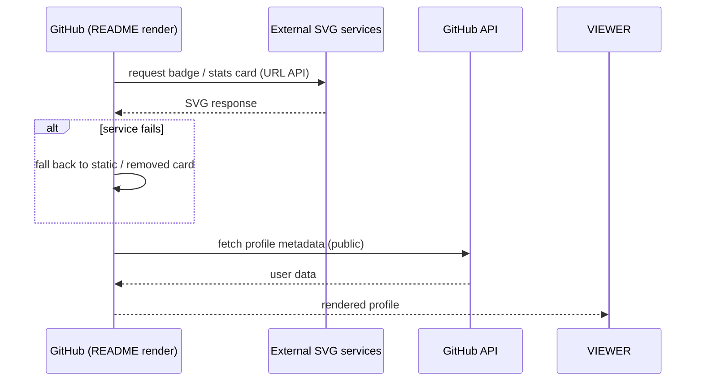

# API — themanoj-025: External Services & Integrations Reference

| Field | Value |
| --- | --- |
| Version | v0.1 |
| Last Updated | 2026-08-06 |
| Owner | Manoj (profile owner) |
| Status | Approved |

---

> The profile consumes third-party image services (each with a URL API) rather than exposing its own API. This document contracts each integration: endpoint pattern, params, failure behavior, and fallback.

## 1. Integration Summary

| Service | Endpoint pattern | Purpose | Auth |
| --- | --- | --- | --- |
| shields.io | `https://img.shields.io/badge/{label}-{value}-{color}?style=...` | Status/skill badges | None |
| readme-typing-svg | `https://readme-typing-svg.herokuapp.com?font=...&lines=...` | Animated hero taglines | None |
| github-readme-stats | `https://github-readme-stats.vercel.app/api?username=...` | Profile stat cards | None |
| streak-stats | `https://streak-stats.demolab.com/?user=...` | Streak card | None |
| activity-graph | `https://github-readme-activity-graph.vercel.app/graph?username=...` | Commit graph | None |
| komarev | `https://komarev.com/ghpvc/?username=...` | View counter | None |
| GitHub API | `https://api.github.com/users/{user}` | Metadata source | Public |

## 2. Badge API (shields.io)

**Pattern:** `https://img.shields.io/badge/{label}-{message}-{color}?style={style}&logo={logo}&logoColor={color}`

| Param | Values used | Notes |
| --- | --- | --- |
| style | flat-square, for-the-badge | flat-square for chips; for-the-badge for arsenal |
| labelColor | hex e.g. 1E293B | Dark panel color |
| logo | e.g. react, typescript | Logo slug |
| color | hex | Foreground/background |

**Response:** SVG image. **Failure:** broken image icon → replace or remove badge.

## 3. Stats Cards API

| Service | Key params | Response | Failure |
| --- | --- | --- | --- |
| github-readme-stats | `username`, `show_icons`, `hide_border`, `theme/colors` | SVG card | Remove card |
| streak-stats | `user`, colors | SVG card | Remove card |
| activity-graph | `username`, colors | SVG graph | Remove graph |

All are read-only, username-keyed, no rate limits documented; generous free tiers.

## 4. Typing Hero API

**Pattern:** `readme-typing-svg.herokuapp.com?font=Fira+Code&weight=600&size=24&pause=1000&color=22D3EE&center=true&vCenter=true&width=650&lines=A;line;B`

| Param | Value |
| --- | --- |
| font | Fira Code |
| lines | 4 taglines (see ../design/Design.md §6.2) |
| color | 22D3EE (accent-cyan) |

**Failure fallback:** remove SVG; hero still shows static name header.

## 5. Theme-Aware Rendering

- `<picture>` blocks with `source media="(prefers-color-scheme: dark)"` for stats cards.
- Badges use `labelColor=0D1117` to blend into dark theme.

## 6. Rate Limits & Dependencies

| Integration | Rate limit | Risk |
| --- | --- | --- |
| GitHub API (anonymous) | 60 req/hr | Stats services cache; fine for profile |
| shields.io | High (cached by GitHub) | Stable |
| Heroku-hosted typing | Service-dependent | Historical flakiness → keep fallback |

## Integration Flow (external services — public, no auth)

## 7. Related Documents

| Document | Relationship |
| --- | --- |
| [TechSpec.md](TechSpec.md) | Where each service fits |
| [Design.md](../design/Design.md) | Visual params per service |
| [RiskRegister.md](../project/RiskRegister.md) | R-01 service outage |
