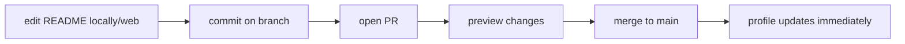

# Deployment — themanoj-025: Profile Shipping & Release

| Field | Value |
| --- | --- |
| Version | v0.1 |
| Last Updated | 2026-08-06 |
| Owner | Manoj (profile owner) |
| Status | Approved |

---

## 1. "Deployment" Model

The profile ships automatically: **merging to the `main` branch of the `<username>/<username>` repository publishes the README to the GitHub profile page.** There is no build step, no server, and no rollback beyond `git revert`.

## 2. Release Flow

## 3. Environment Promotion

| Stage | Where | Verification |
| --- | --- | --- |
| Draft | Local editor / PR branch | Markdown preview + link check |
| Production | main branch (only env) | Live profile render |

- Preview method: GitHub web editor "Preview changes" tab or `markdown-preview` on a fork.
- External services render asynchronously; final visual check after merge.

## 4. Rollback Procedure

1. Bad change detected (broken render, wrong link).
2. `git revert <merge commit>` (or fix-forward PR).
3. Push to main → profile restores immediately.
4. Log rollback in ../project/Tracker.md changelog.

## 5. Automation (planned)

- GitHub Action `cron` weekly: regenerate contribution heatmap/stat SVGs → commit → push.
- Action `pull_request`: run lychee + markdownlint + gitleaks (see Testing.md §5).
- Permissions: `contents: write` scoped to this repo only.

## 6. Feature Flag Policy

- No flags. Content visibility controlled by section status (live/draft) in Schema.md.
- Phased rollout of new sections: draft in README commented out → verify → uncomment.

## 7. On-Call / Runbook Basics

- **Service badge broken** → check service status; swap badge params or remove.
- **Stats card frozen** → stats service cache; wait or use `?cachebuster` param.
- **Typing SVG slow** → hero still readable (static header); no action required.
- **Unintended commit to main** → revert + enable branch protection.

## 8. Related Documents

| Document | Relationship |
| --- | --- |
| [TechSpec.md](TechSpec.md) | Rendering pipeline |
| [Testing.md](Testing.md) | Pre-merge gates |
| [ImplementationPlan.md](../project/ImplementationPlan.md) | Phase 2 automation tasks |
