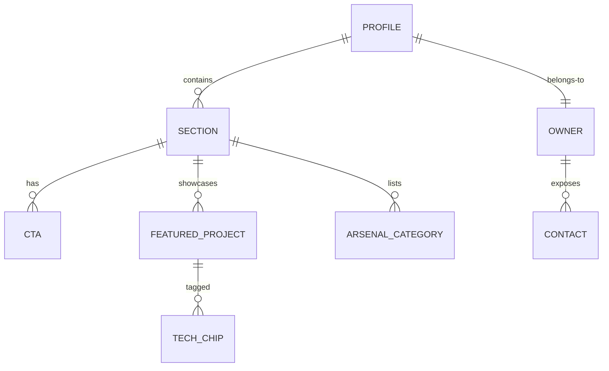

# Schema — themanoj-025: Profile Content Model

| Field | Value |
| --- | --- |
| Version | v0.1 |
| Last Updated | 2026-08-06 |
| Owner | Manoj (profile owner) |
| Status | Approved |

---

> The profile has no database; this is the **content model** of README.md — the "tables" are the structured content blocks an editor or automation must keep consistent.

## 1. Content Model Diagram



## 2. Entity Definitions

### TBL-owner (profile owner)

| Field | Type | Notes |
| --- | --- | --- |
| username | string | `themanoj-025` |
| display_name | string | Manoj |
| title | string | "AI Systems Engineer" |
| email | string | `code.me.025@gmail.com` |
| linkedin | URL | `/in/manoj-jana-b78a10266` |
| resume_url | URL | raw Resume.pdf |

### TBL-section

| Field | Type | Notes |
| --- | --- | --- |
| id | string | SEC-001..SEC-006 (see ../design/AppFlow.md) |
| heading | string | Section title |
| order | int | Render order |
| status | enum | live / draft / removed |

### TBL-featured_project

| Field | Type | Notes |
| --- | --- | --- |
| name | string | Repo display name |
| repo_url | URL | github.com/themanoj-025/<repo> |
| description | string | 1–2 sentences |
| emoji | string | Section icon |
| chips | list | Tech badge list (≤ 4) |
| slot | int | 1..6 (max 6 slots) |

Current slots (2026-08-06): Match-Mind, AegisAI, UNION-BANK-, Smart-Spam-Detector, AI-Telegram-News-Bot, Emotion-Lens.

### TBL-arsenal_category

| Field | Type | Notes |
| --- | --- | --- |
| id | string | Slug e.g. `agentic-frameworks` |
| label | string | "Agentic Frameworks & GraphRAG" |
| order | int | Category position |
| badges | list | Shields.io badge markdown (≤ 12) |
| status | enum | live / draft |

### TBL-contact (CTA rows)

| Field | Type | Notes |
| --- | --- | --- |
| id | string | e.g. `cta-github` |
| label | string | "View My Work" |
| href | URL | Target |
| badge_color | hex | Shields color param |

## 3. Relationships

| From | To | Type | Notes |
| --- | --- | --- | --- |
| TBL-section.cta | TBL-contact | 1:N | Hero/footer CTA groups |
| TBL-section.projects | TBL-featured_project | 1:N | Showcase section |
| TBL-section.arsenal | TBL-arsenal_category | 1:N | Arsenal section |
| TBL-featured_project.chips | Tech chips | 1:N | Inline badges |

## 4. Indexes / Consistency Keys

| Key | Why |
| --- | --- |
| `repo_url` uniqueness | No duplicate featured repos |
| CTA href validity | Link health gate (REQ-030) |
| Slot ≤ 6 | Grid capacity |

## 5. Enums / Constants

| Field | Values |
| --- | --- |
| section.status | live, draft, removed |
| arsenal.status | live, draft |
| slot | 1–6 |
| chips max | 4 per project |

## 6. Data Lifecycle

- Retention: content persists until owner edits; **no automated deletion**.
- Versioning: git history is the audit trail; every change is a commit/PR.
- Archival: old stats cards are replaced, not deleted (comments can preserve prior configs).

## 7. "Migrations" Strategy

- Equivalent: markdown edits via PR with preview; breaking changes (e.g., removing a section) noted in PR description.
- Naming/rollback: revert commit restores prior state (git revert).

## 8. Sample Record

```markdown
<!-- Featured project entry -->
<h3>🧩 <a href="https://github.com/themanoj-025/MatchMind">Match-Mind</a></h3>
<p><em>Real-time sports analytics platform with AI insights (Claude), WebSockets, and queue-backed jobs.</em></p>
<!-- chips: React 19 / TypeScript / Redis-BullMQ / Claude API -->
```

## 9. Validation Rules

| Field | Rule | Enforced By |
| --- | --- | --- |
| repo_url | Must resolve (200) | Link checker |
| email | Valid format | Manual/CI lint |
| badge params | Valid color hex / style | Shields service validation |
| alt text | Present on every image | Manual review |
| slot count | ≤ 6 | Manual review |

## 10. Sensitive Data Map

| Field | Sensitivity | Notes |
| --- | --- | --- |
| email | PII (public by choice) | Public mailto; expect spam; dedicated inbox |
| resume | PII (public by choice) | Public raw link |
| Everything else | Public | Profile is intentionally public |

## 11. Related Documents

| Document | Relationship |
| --- | --- |
| [AppFlow.md](../design/AppFlow.md) | Sections modeled here |
| [PRD.md](../product/PRD.md) | REQ-030 link health |
| [SecurityAndCompliance.md](SecurityAndCompliance.md) | Disclosure policy |
