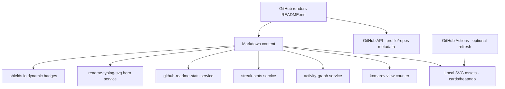
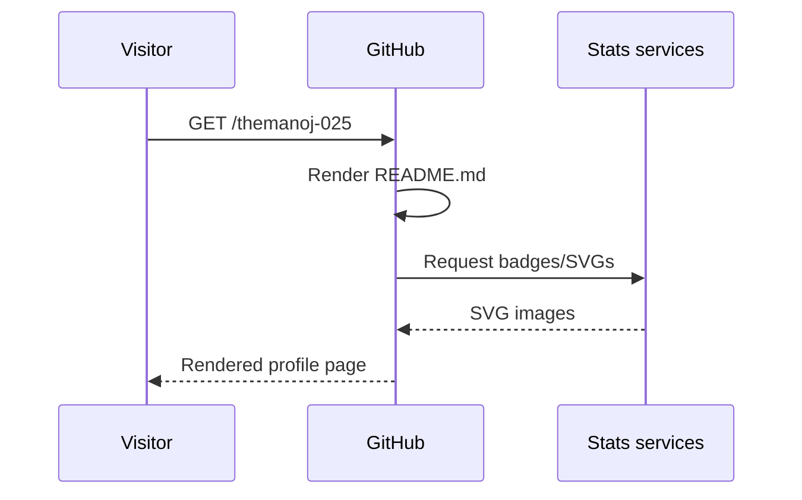
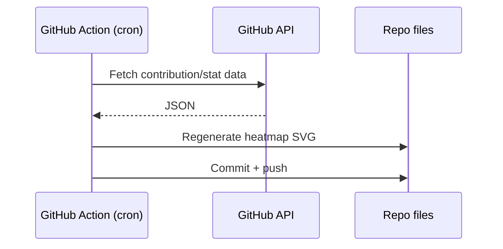
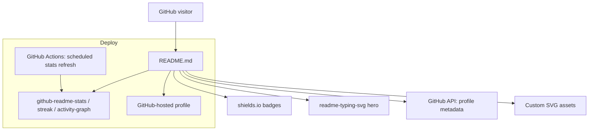

# TechSpec — themanoj-025: Technical Specification (Profile Platform)

| Field | Value |
| --- | --- |
| Version | v0.1 |
| Last Updated | 2026-08-06 |
| Owner | Manoj (profile owner) |
| Status | Approved |

---

## 1. Architecture Overview

**Key insight:** The "app" is GitHub's markdown rendering pipeline; all dynamic elements are external image services keyed off the username; local SVG assets are committed files.

## 2. Tech Stack Table

| Layer | Technology | Justification |
| --- | --- | --- |
| Content | Markdown (GitHub-flavored) | Native rendering, zero build step |
| Badges | shields.io (static + dynamic) | Standard, theme-aware, free |
| Typing intro | readme-typing-svg | Animated hero without JS |
| Stats | github-readme-stats + streak-stats + activity-graph | Live proof-of-work visuals |
| Custom SVG | Hand-authored/scripted SVG (info-card, ascii, heatmap) | Branded identity assets |
| Automation | GitHub Actions (planned) | Refresh stats/heatmap on schedule |
| Version control | Git + GitHub | Single source of truth |

## 3. System Components

| Component | Responsibility | Inputs/Outputs | Failure Modes |
| --- | --- | --- | --- |
| README.md | Single source of all content | Markdown → rendered page | Broken syntax → ugly render (CI can check) |
| Badge services | Render skill/status badges | Query params → SVG | Service down → broken image icon |
| Stats services | Render live metrics | Username → SVG charts | Rate limits, service outage |
| Local SVGs | Static identity assets | File → image | Stale if not regenerated |
| GitHub API | Source for stats services | Username → JSON | Rate limit (60/hr unauthenticated) |

## 4. Data Flow Diagrams

### 4.1 Visitor Loads Profile

### 4.2 Stats Refresh (planned Action)

## 5. Third-Party Integrations

| Service | Purpose | Failure Fallback | Cost | Rate Limits |
| --- | --- | --- | --- | --- |
| shields.io | Badges | Static badge URLs cached by GitHub | Free | Generous |
| readme-typing-svg | Hero animation | Remove/static text | Free | Service-level |
| github-readme-stats | Profile stats | Remove card | Free | Service-level |
| streak-stats | Streak card | Remove card | Free | Service-level |
| github-readme-activity-graph | Activity chart | Remove graph | Free | Service-level |
| komarev | View counter | Remove badge | Free | Service-level |
| GitHub API | Metadata for above | Manual refresh | Free | 60 req/hr unauth |

## 6. Non-Functional Requirements

| Category | Requirement | Target | How Verified |
| --- | --- | --- | --- |
| Performance | Profile first render | < 3 s (badges cached) | Manual/WebPageTest on profile URL |
| Availability | External services | ≥ 99% (per service) | Monthly link check |
| Reliability | No broken links | 0 broken hrefs | Link checker script |
| Security | No secrets in repo | 0 | pre-commit secret scan |
| Maintainability | Content editable by owner | Any change < 30 min | Documentation in ../project/Rules.md |

## 7. Environments

| Env | URL | Data | Purpose |
| --- | --- | --- | --- |
| Production | github.com/themanoj-025 | Live profile | Only environment |
| Draft | local markdown preview / PR branch | Proposed changes | Test renders before merge |

## 8. Error Handling Strategy

- Badge failure: GitHub shows broken image icon; mitigation = monthly link check + alternative service swap.
- Stats card failure: remove card until service recovers.
- Render regression: preview via README preview tab or markdown renderer before commit.
- Secret leak: rotate credential immediately, purge history (see SecurityAndCompliance.md).

## 9. Observability

- Profile views via komarev counter (external).
- GitHub repo traffic insights (unique visitors, referrers) via repo Insights tab.
- No custom logging (static repo); rely on GitHub analytics + manual checks.

## 10. Technical Risks & Mitigations

| Risk | Mitigation |
| --- | --- |
| External service shutdown | Keep local fallbacks (static SVGs); list alternatives in ../project/Rules.md |
| SVG asset staleness | Regeneration script (REQ-032) + manual review |
| Markdown render differences | Use only GitHub-compatible markdown features |
| Unauthorized edits | Branch protection on main; review PRs |

## Deployment Topology

## 11. Related Documents

| Document | Relationship |
| --- | --- |
| [PRD.md](../product/PRD.md) | Requirements this spec implements |
| [Design.md](../design/Design.md) | Visual tokens for SVGs/badges |
| [API.md](API.md) | External service contracts |
| [Deployment.md](Deployment.md) | How content reaches production |
