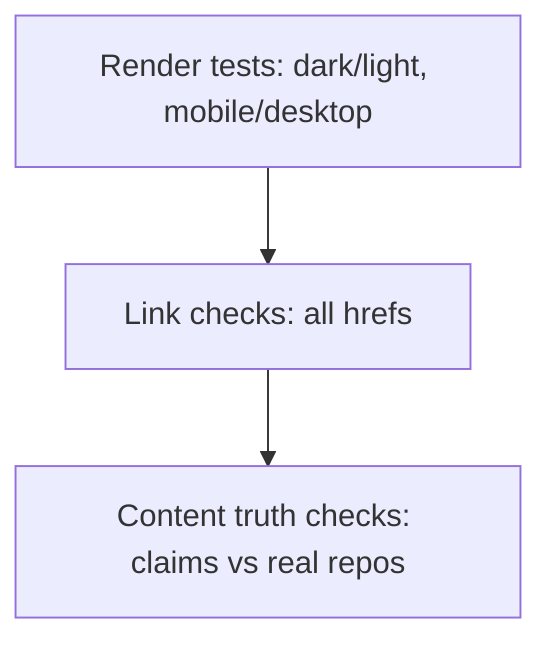

# Testing — themanoj-025: Verification Strategy

| Field | Value |
| --- | --- |
| Version | v0.1 |
| Last Updated | 2026-08-06 |
| Owner | Manoj (profile owner) |
| Status | Approved |

---

## 1. Test Pyramid (adapted: no code, so verification is content/render/links)

## 2. Verification Areas

| Area | What is verified | Method |
| --- | --- | --- |
| Link health | Every href resolves 200 | lychee link checker or manual sweep |
| Render | Sections display correctly | GitHub web preview (dark + light) |
| Image services | Badges/cards/SVGs load | Visual check + service status |
| Alt text | Every `` has alt | Manual/HTML lint |
| Content truth | Featured repos exist; skills match repos | Cross-check against github.com/themanoj-025 |

## 3. Critical Test Cases

| Case | Expected |
| --- | --- |
| Visit profile on desktop | Hero, CTAs, grid, arsenal, stats all render |
| Visit profile on mobile | Single column, no overflow |
| Click "View My Work" | Opens GitHub profile (200) |
| Click each featured project link | All 6 resolve (200) |
| Click "Resume" | Raw PDF downloads (200) |
| Dark mode | Stats cards use dark variants |
| Any image missing | Alt text visible, layout intact |

## 4. Test Data

- Real data only (live GitHub account); no synthetic fixtures.
- Preview branch for proposed changes before merging to main.

## 5. CI Gates (recommended)

| Gate | Tool | Blocking |
| --- | --- | --- |
| Link check | lychee action | Yes (on changed links) |
| Markdown lint | markdownlint | Yes (on changed file) |
| Secret scan | gitleaks | Yes |
| HTML alt lint | custom grep/action | Yes |

## 6. Related Documents

| Document | Relationship |
| --- | --- |
| [Rules.md](../project/Rules.md) | Requirements (Section 4) |
| [API.md](API.md) | Service endpoints under check |
| [AppFlow.md](../design/AppFlow.md) | Sections to verify |
